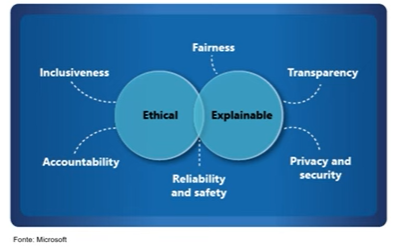

# Conceitos fundamentais de Inteligência Artificial

## I.A Responsável - Imparcial

### Resumo

Uma das preocupações sobre a inteligência artificial é de onde as informações são extraídas.

**Seus princípios são:**

1. [Imparcialidade](#imparcialidade)
2. [Confiabilidade e Segurança](#confiabilidade-e-segurança)
3. [Privacidade e Segurança](#privacidade-e-segurança)
4. [Inclusão e Transparência](#inclusão-e-transparência)
5. [Responsabilidade](#responsabilidade)
 
### Princípios:

#### Imparcialidade
- O preconceito pode afetar os resultados.
- Um modelo de aprovação de empréstimos pode discriminar por gênero devido ao preconceito nos dados com os quais foi treinado.

  - A IA é treinada com códigos inseridos por humanos. É necessário verificar sempre se os códigos a serem treinados são imparciais.

#### Confiabilidade e Segurança

  - Erros podem causar danos.
  - Um veículo autônomo sofre uma falha no sistema e causa uma colisão.

   - É necessário realizar o treinamento da IA com todas as possibilidades possíveis.

#### Privacidade e Segurança
  
   - Dados privados podem ser expostos.
   - Um bot de banco é treinado usando dados confidenciais de pacientes e armazenados de forma insegura.

   - É necessário adicionar transparência, métodos de criptografia em dados, identificar vulnerabilidades, restrição de acesso e auditorias para garantir que nenhuma informação seja vazada.

#### Inclusão e Transparência

##### Inclusão   
  
  - As soluções podem não funcionar para todos os usuários.
  - Um app não fornece saída de áudio para um usuário com deficiência visual.

  - É necessário sempre buscar soluções que incluam todos os tipos de usuários.

##### Transparência

  - Os usuários devem confiar em um sistema complexo.
  - Uma ferramenta de IA que recomenda investimentos.

  - É necessário ter um [scorecard](https://learn.microsoft.com/pt-br/azure/internet-analyzer/internet-analyzer-scorecard) na IA para mostrar os testes realizados e em que ela se baseia, a fim de provar a confiabilidade ao usuário final.

#### Responsabilidade

 - Quem é responsável pelas decisões baseadas na IA?
 - Um inocente foi condenado por um crime com base em provas de reconhecimento facial.
 - Um app de recomendação de remédios indica um remédio incorreto e o paciente pode vir a óbito.

 - Uma IA não pode, de forma alguma, afetar a vida das pessoas. É necessário sempre trabalhar com modelos e dados confiáveis.
