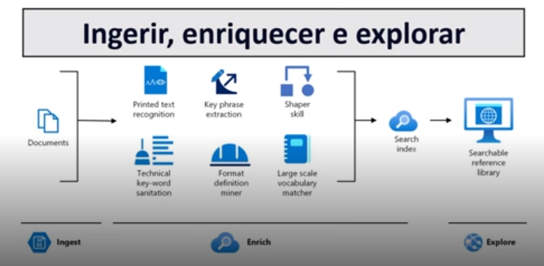

# Conceitos fundamentais de Inteligência Artificial

## Mineração de conhecimentos

Capacidade da IA de transformar dados não estruturados em estruturados

## Fluxo de mineração

As etapas são resumidas em:
1. Ingerir: Receber os dados não estruturados

2. Enriquecer: Encontrar padrões, analisar com modelos cognitivos

3. Explorar: Utilizar os dados de maneira estruturados
(A Azure Cognitive Search permite essa análise)

### Exemplos:

Marketing: Uma equipe de Marketing para receber notícias em alta, pode utilizar a mineração para encontrar padrões e identificar as mais relevantes.